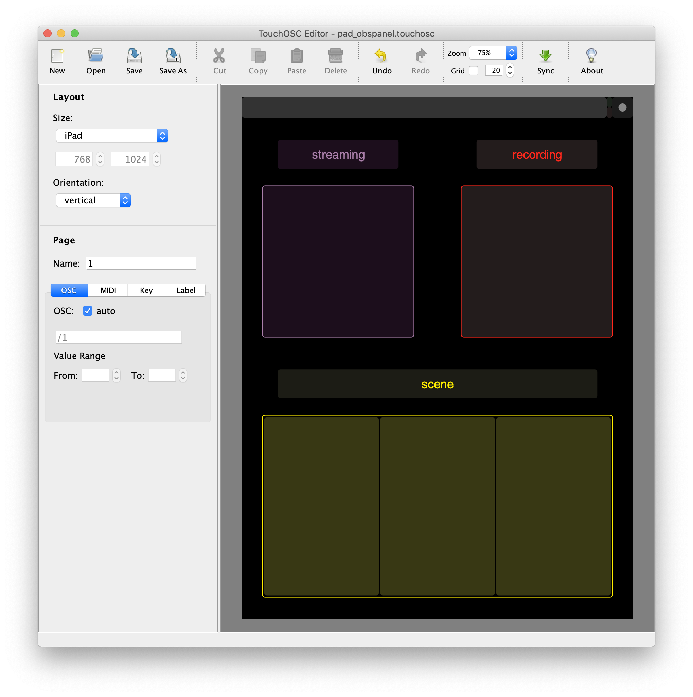

# oscshorcut

구형 타블렛에 TouchOSC앱으로 OBS studio를 제어하기 위한 프로그램.

예로, OBS studio에 다음과 같이 단축키를 설정:

* Ctrl+F9 : 방송시작
* Ctrl+F10 : 방송중단

TouchOSC의 버튼 컨트롤의 주소와 값을 위의 단축키로 매핑하기위해 `shortcuts.json`을
아래와 같이 정의해 사용:

    [
        {
            "oscVal": {
                "addr": "/1/toggle_streaming",
                "val": 1
            },
            "keyComb": {
                "description": "streaming on",
                "key": "F9",
                "ctrl": true
            }
        },
        {
            "oscVal": {
                "addr": "/1/toggle_streaming",   
                "val": 0
            },
            "keyComb": {
                "description": "streaming off",
                "key": "F10",
                "ctrl": true
            }
        },
        ...
    ]

## reference

* [TouchOSC](https://hexler.net/products/touchosc)
